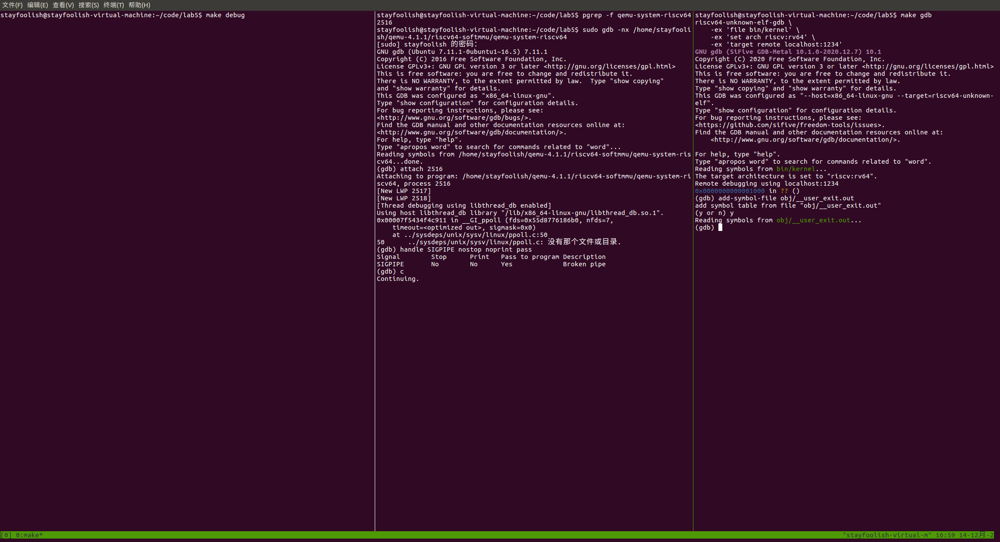
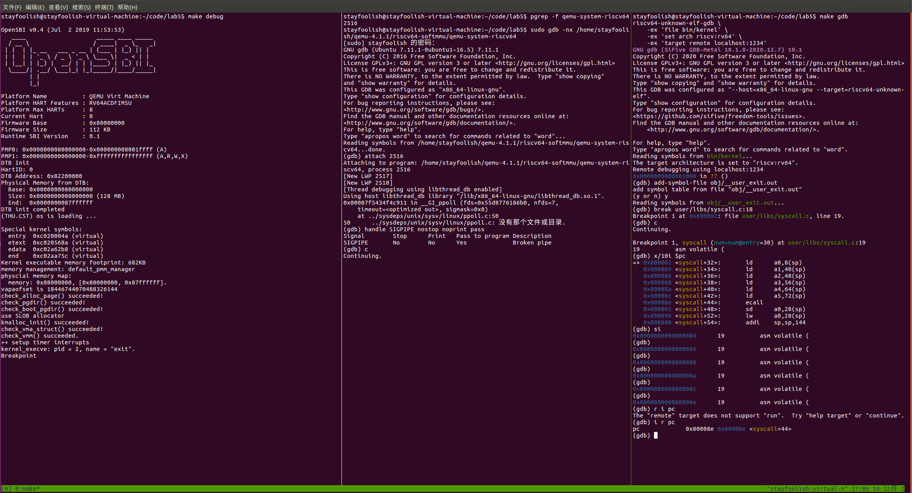
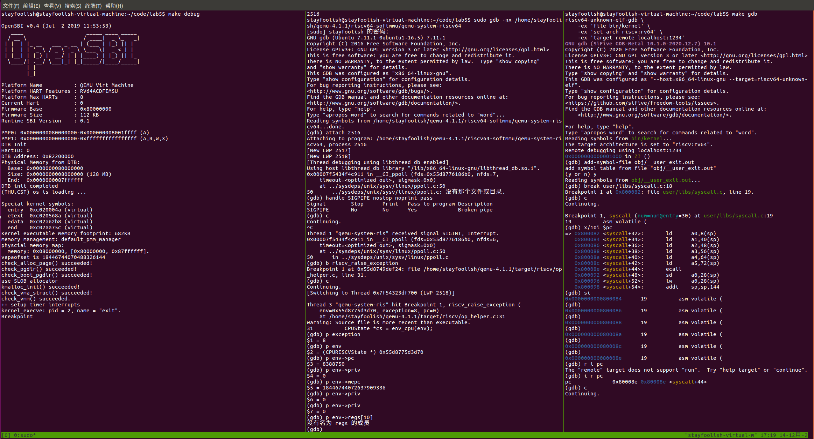
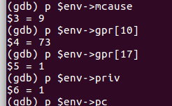
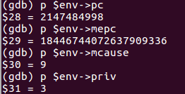
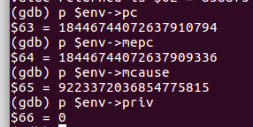
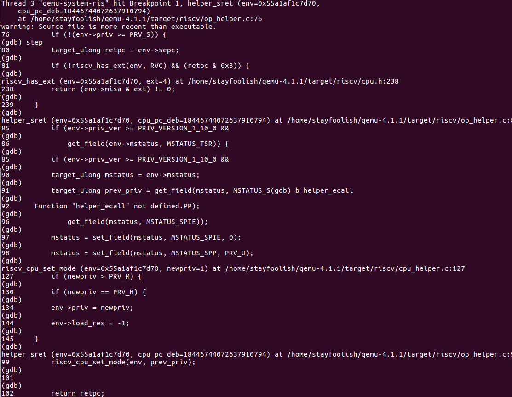

# 练习1: 加载应用程序并执行

## 设计实现过程
在 load_icode 函数中，为用户环境设置 trapframe，确保进程从内核态正确返回到用户态并开始执行应用程序。

- 获取当前进程的 trapframe 结构体指针 tf，并保存原有的 sstatus 值。
- 使用 memset 将整个 trapframe 清零，避免残留旧数据。
- 设置 trapframe 的关键字段：
  - `tf->gpr.sp = USTACKTOP;`：设置用户栈顶地址，确保用户程序有正确的栈空间。
  - `tf->epc = elf->e_entry;`：设置程序计数器为 ELF 文件的入口点地址，确保从应用程序的起始地址开始执行。
  - `tf->status = (sstatus & ~SSTATUS_SPP) | SSTATUS_SPIE;`：基于保存的 sstatus 设置状态寄存器，清除 SPP 位（表示从用户模式返回），设置 SPIE 位（启用中断），确保进程从内核态正确返回用户态。

## 用户态进程被ucore选择占用CPU执行（RUNNING态）到具体执行应用程序第一条指令的整个经过
1.  **调度器选择进程 (`schedule`)**: 当需要进行进程调度时（如时钟中断），内核调用 `schedule` 函数，遍历 `proc_list` 找到下一个处于 `PROC_RUNNABLE` 状态的进程 `next`。

2.  **执行进程切换 (`proc_run`)**: `schedule` 调用 `proc_run(next)` 来执行切换。此函数会：
    -   将全局变量 `current` 指向新进程 `next`。
    -   调用 `lsatp(next->pgdir)` 加载新进程的页目录基址到 `satp` 寄存器，完成地址空间切换。
    -   调用 `switch_to(&(prev->context), &(next->context))`，保存当前进程的内核上下文（寄存器 `ra`, `sp` 等）并恢复新进程的内核上下文。

3.  **返回到内核入口点 (`forkret`)**: `switch_to` 的最后一步是 `ret` 指令，它会跳转到 `ra` 寄存器中的地址。
    -   **返回地址设置**: 这个 `ra` 的值是在进程**最初被创建**时，于 `copy_thread` 函数中统一设置的：`proc->context.ra = (uintptr_t)forkret;`。
    -   对于 `exec` 的进程，它只是替换了用户内存和 `trapframe`，其内核上下文 `context`（包括 `ra`）继承自它被创建时的设置，因此 `ra` 仍然指向 `forkret`。

4.  **准备返回用户态 (`forkret` -> `forkrets` -> `__trapret`)**: `forkret` 函数调用汇编函数 `forkrets(current->tf)`。`forkrets` 将栈指针设置为 `trapframe` 的地址，然后跳转到 `__trapret`。`__trapret` 通过 `RESTORE_ALL` 从 `trapframe` 中恢复所有通用寄存器、`sstatus` 和 `sepc`，最后执行 `sret` 指令。

5.  **从内核态切换到用户态 (`sret`)**: `forkrets` 的最后一条指令是 `sret`。该指令原子地完成以下操作：
    -   将 CPU 权限级别从内核态切换到用户态。
    -   将程序计数器（PC）的值设置为 `sepc` 寄存器中的值。
    -   **`sepc` 的设置**: 对于一个通过 `exec` 加载的新程序，`sepc` 的值是在 `load_icode` 函数中通过设置 `tf->epc = elf->e_entry;` 来确定的。`forkrets` 会将这个值加载到 `sepc`。

6.  **执行应用程序第一条指令**: `sret` 执行后，CPU 处于用户态，PC 指向了新程序的入口地址，进程开始执行应用程序代码。

# 练习2: 父进程复制自己的内存空间给子进程（需要编码）

## `copy_range` 概述
`copy_range` 函数的核心任务是将父进程地址空间中的一块内存区域（由 `start` 和 `end` 地址定义）复制到子进程的新地址空间中。这是实现 `fork()` 系统调用时创建子进程的关键步骤。该函数通过逐页复制的方式，为子进程创建一个与父进程内容相同但物理上独立的内存副本。具体来说，它会遍历指定的虚拟地址范围，为每一页分配新的物理内存，复制内容，并在子进程的页表中建立正确的映射。

## 设计实现过程
在 `copy_range` 函数中，我们按以下步骤实现内存范围的复制：

- **遍历地址范围**：函数以页（`PGSIZE`）为单位，从 `start` 地址遍历到 `end` 地址。
- **获取源页表项**：对每个地址，调用 `get_pte(from, start, 0)` 获取父进程对应的页表项（PTE）。
  - 如果源页表项不存在（`ptep == NULL`），则表示该地址范围未映射，直接跳过整个页表范围（`PTSIZE` 大小），以提高效率：`start = ROUNDDOWN(start + PTSIZE, PTSIZE); continue;`。
- **分配与映射**：
    - 如果父进程的页表项有效（`*ptep & PTE_V`），则为子进程分配一个新的物理页（`alloc_page()`）。
    - 调用 `get_pte(to, start, 1)` 确保子进程的页表存在，如果不存在则创建。
- **复制页面内容**：
    - 使用 `page2kva` 分别获取源物理页和新分配的目标物理页的内核虚拟地址。
    - 使用 `memcpy` 将源页面的内容（大小为 `PGSIZE`）完整复制到目标页面。
- **建立映射**：调用 `page_insert(to, npage, start, perm)`，将新创建的物理页 `npage` 映射到子进程的虚拟地址 `start`，并设置相应的权限 `perm`。

## 如何设计实现Copy on Write机制？

写时复制（Copy-on-Write, COW）是一种优化 `fork` 操作的策略。它避免了在创建子进程时立即复制整个地址空间，而是让父子进程共享物理页面，直到其中一方尝试写入共享页面时，才真正进行复制。

### 概要设计
- 在 `fork` 创建子进程时，`copy_range` 函数不再复制物理页面，而是让父、子进程共享同一物理页面，并将这些共享页面的页表项（PTE）标记为**只读**（清除 `PTE_W` 位）。
- 当父进程或子进程尝试向共享页面写入数据时，会触发一个页错误（Page Fault）。
- 在页错误处理程序中，内核识别出这是一个 COW 事件，此时才为写入方分配一个新的物理页面，将共享页面的内容复制到新页面，然后更新其页表项，将新页面映射为**可写**，最后让进程恢复执行。

### 详细设计
1.  **修改 `copy_range` 函数**：
    -   不再调用 `alloc_page()` 分配新页面和 `memcpy` 复制内容。
    -   直接调用 `page_insert(to, page, start, perm & ~PTE_W)`，将父进程的物理页面 `page` 映射到子进程的地址空间，但权限中去掉 `PTE_W`（可写）位。
    -   同时，将父进程对应的页表项也设置为只读。
    -   增加共享物理页面的引用计数 `page_ref_inc(page)`。

2.  **扩展页错误处理程序（`do_pgfault` in `trap.c`）**：
    -   当发生页错误时，检查错误原因（`scause`）。如果是因为“存储页错误”（Store Page Fault），并且对应的页表项是只读的。
    -   检查该物理页是否为 COW 页面（例如，通过检查其引用计数 `page_ref(page) > 1`）。
    -   如果是 COW 页面：
        -   分配一个新页面（`alloc_page()`）。
        -   将旧的共享页面的内容复制到新页面。
        -   使用 `page_insert` 更新当前进程的页表，将虚拟地址映射到新分配的物理页面，并设置权限为**可写**。
        -   将旧页面的引用计数减一（`page_ref_dec(page)`）。

3.  **标志管理**：
    - 使用 `pte_t` 中的 `PTE_COW` 标志来明确标识 COW 状态。
    - 需要确保内核态的页面不参与 COW 机制。

# 练习3: 阅读分析源代码，理解进程执行 fork/exec/wait/exit 的实现，以及系统调用的实现（不需要编码）

## fork/exec/wait/exit 函数分析

### fork 函数
`fork()` 用于创建一个子进程，子进程是父进程的完整副本。在 ucore 中的实现流程：
- **用户态**：调用 `sys_fork()`，通过 `syscall()` 函数使用 `ecall` 指令进入内核态
- **内核态**：`do_fork()` 函数完成以下操作：
  1. 调用 `alloc_proc()` 分配新的进程控制块
  2. 调用 `setup_kstack()` 为子进程分配内核栈
  3. 调用 `copy_mm()` 复制或共享父进程的内存空间
  4. 调用 `copy_thread()` 设置子进程的 trapframe 和 context，其中 `a0` 寄存器设置为 0（用于区分父子进程）
  5. 分配唯一的 PID 并加入进程链表
  6. 调用 `wakeup_proc()` 将子进程状态设置为 `PROC_RUNNABLE`
- **返回值**：父进程返回子进程的 PID，子进程返回 0

### exec 函数
`exec()` 用于加载并执行一个新的程序，替换当前进程的内存映像。在 ucore 中的实现流程：
- **用户态**：调用 `sys_exec()`，通过 `syscall()` 进入内核态
- **内核态**：`do_execve()` 函数完成以下操作：
  1. 释放当前进程的旧内存空间（`exit_mmap()`, `put_pgdir()`, `mm_destroy()`）
  2. 调用 `load_icode()` 加载新的 ELF 程序：
     - 创建新的内存管理结构 `mm_struct`
     - 解析 ELF 文件头，加载各个段（TEXT、DATA、BSS）
     - 建立用户栈空间
     - 设置新的 trapframe（`epc` 指向程序入口，`sp` 指向用户栈顶）
  3. 更新进程名称
- **返回值**：成功返回 0，失败返回错误码

### wait 函数
`wait()` 用于父进程等待子进程结束并回收资源。在 ucore 中的实现流程：
- **用户态**：调用 `sys_wait()`，通过 `syscall()` 进入内核态
- **内核态**：`do_wait()` 函数完成以下操作：
  1. 查找指定 PID 的子进程（如果 pid=0，则查找任意子进程）
  2. 如果找到的子进程处于 `PROC_ZOMBIE` 状态：
     - 读取子进程的退出码（如果 `code_store` 不为空）
     - 从进程链表中移除子进程
     - 释放子进程的内核栈和进程控制块
     - 返回 0
  3. 如果子进程尚未结束：
     - 将当前进程状态设置为 `PROC_SLEEPING`
     - 设置 `wait_state = WT_CHILD`
     - 调用 `schedule()` 让出 CPU，等待被唤醒
     - 被唤醒后重新检查子进程状态

### exit 函数
`exit()` 用于终止当前进程。在 ucore 中的实现流程：
- **用户态**：调用 `sys_exit()`，通过 `syscall()` 进入内核态
- **内核态**：`do_exit()` 函数完成以下操作：
  1. 释放进程的内存空间（`exit_mmap()`, `put_pgdir()`, `mm_destroy()`）
  2. 将进程状态设置为 `PROC_ZOMBIE`
  3. 保存退出码 `exit_code`
  4. 将所有子进程的父进程设置为 `initproc`
  5. 如果父进程正在等待（`wait_state == WT_CHILD`），唤醒父进程
  6. 调用 `schedule()` 切换到其他进程（进程永远不会从 `do_exit()` 返回）

## fork/exec/wait/exit 的执行流程分析

### 用户态与内核态的执行划分

#### 用户态完成的操作：
1. **系统调用准备**：在 `user/libs/syscall.c` 中，用户程序调用 `sys_fork()`, `sys_exec()`, `sys_wait()`, `sys_exit()` 等包装函数
2. **参数传递**：将系统调用号和参数放入寄存器（`a0` 存放系统调用号，`a1-a5` 存放参数）
3. **触发系统调用**：执行 `ecall` 指令，触发异常进入内核态
4. **接收返回值**：从 `a0` 寄存器读取系统调用的返回值

#### 内核态完成的操作：
1. **异常处理**：`trap()` 函数捕获 `ecall` 异常，调用 `exception_handler()`
2. **系统调用分发**：`syscall()` 函数根据系统调用号从 `syscalls[]` 数组中查找对应的处理函数
3. **具体功能实现**：执行 `do_fork()`, `do_execve()`, `do_wait()`, `do_exit()` 等核心函数
4. **进程管理**：创建/销毁进程、管理进程状态、调度进程等
5. **内存管理**：分配/释放内存、复制地址空间、加载程序等
6. **设置返回值**：将返回值写入 `trapframe->gpr.a0`

### 内核态与用户态程序的交错执行

系统调用的完整执行流程如下：

```
用户态程序
  ↓
sys_fork() / sys_exec() / sys_wait() / sys_exit()  [用户态]
  ↓
syscall() [用户态，准备参数]
  ↓
ecall 指令 [触发异常，CPU 自动切换到内核态]
  ↓
__alltraps [内核态，保存用户态上下文到 trapframe]
  ↓
trap() [内核态]
  ↓
exception_handler() [内核态，识别为 CAUSE_USER_ECALL]
  ↓
syscall() [内核态，分发系统调用]
  ↓
do_fork() / do_execve() / do_wait() / do_exit() [内核态，执行具体功能]
  ↓
设置 trapframe->gpr.a0 = 返回值 [内核态]
  ↓
__trapret [内核态，从 trapframe 恢复用户态上下文]
  ↓
sret 指令 [CPU 自动切换回用户态，PC = sepc]
  ↓
用户态程序继续执行 [用户态，从 syscall() 返回，读取 a0 寄存器]
```

关键点：
- **进入内核态**：通过 `ecall` 指令触发异常，CPU 硬件自动保存用户态上下文并切换到内核态
- **内核态执行**：在内核态中完成所有需要特权的操作（进程管理、内存管理等）
- **返回用户态**：通过 `sret` 指令，CPU 硬件从 `trapframe` 恢复用户态上下文并切换回用户态

### 内核态执行结果返回给用户程序的方式

1. **返回值设置**：内核态函数（如 `do_fork()`）的返回值被写入 `trapframe->gpr.a0`：
   ```c
   tf->gpr.a0 = syscalls[num](arg);  // 在 syscall() 函数中
   ```

2. **上下文恢复**：`__trapret` 汇编代码通过 `RESTORE_ALL` 宏从 `trapframe` 恢复所有寄存器，包括 `a0`

3. **用户态读取**：用户态程序从 `a0` 寄存器读取返回值：
   ```c
   // 在 syscall() 函数中（用户态）
   asm volatile (
       "ecall\n"
       "sd a0, %0"
       : "=m" (ret)
       : ...
   );
   return ret;  // 返回给用户程序
   ```

## ucore 中用户态进程的执行状态生命周期图

```
                    alloc_proc()
                         |
                         v
                  PROC_UNINIT (未初始化)
                         |
                         | proc_init() / wakeup_proc()
                         |
                         v
                 PROC_RUNNABLE (可运行)
                         |
         +---------------+---------------+
         |                               |
         | schedule() 选择进程            | do_fork() 创建子进程
         |                               |
         v                               |
    RUNNING (运行中)                      |
         |                               |
         | 时间片用完 / yield()           |
         |                               |
         +--------> PROC_RUNNABLE <------+
         |                               |
         | do_wait() / do_sleep()        |
         |                               |
         v                               |
    PROC_SLEEPING (睡眠)                  |
         |                               |
         | wakeup_proc()                 |
         |                               |
         +--------> PROC_RUNNABLE        |
         |                               |
         | do_exit()                     |
         |                               |
         v                               |
     PROC_ZOMBIE (僵尸) <-----------------+
         |                               |
         | do_wait() 回收资源             |
         |                               |
         v                               |
        销毁 (从系统中移除)
```

### 状态说明

- **PROC_UNINIT**：进程刚被分配，尚未初始化
  - 转换事件：`alloc_proc()`
  - 转换到：`PROC_RUNNABLE`（通过 `proc_init()` 或 `wakeup_proc()`）

- **PROC_RUNNABLE**：进程已准备好运行，等待被调度
  - 转换事件：`proc_init()`, `wakeup_proc()`, `do_fork()`, `schedule()` 切换后
  - 转换到：`RUNNING`（被 `schedule()` 选择执行），`PROC_SLEEPING`（调用 `do_wait()` 或 `do_sleep()`），`PROC_ZOMBIE`（调用 `do_exit()`）

- **RUNNING**：进程正在 CPU 上执行（这是一个逻辑状态，实际在 `PROC_RUNNABLE` 状态中）
  - 转换事件：`proc_run()` 切换上下文后
  - 转换到：`PROC_RUNNABLE`（时间片用完、调用 `yield()`、或被更高优先级进程抢占）

- **PROC_SLEEPING**：进程因等待某个事件而睡眠
  - 转换事件：`do_wait()`（等待子进程），`do_sleep()`（主动睡眠）
  - 转换到：`PROC_RUNNABLE`（被 `wakeup_proc()` 唤醒）

- **PROC_ZOMBIE**：进程已退出，但资源尚未被父进程回收
  - 转换事件：`do_exit()`
  - 转换到：销毁（父进程调用 `do_wait()` 回收资源后）

### 状态转换的关键函数调用

1. **PROC_UNINIT → PROC_RUNNABLE**：
   - `proc_init()`：初始化 idleproc 和 initproc
   - `wakeup_proc()`：唤醒睡眠的进程

2. **PROC_RUNNABLE → RUNNING**：
   - `schedule()`：选择下一个要运行的进程
   - `proc_run()`：切换到选中的进程

3. **RUNNING → PROC_RUNNABLE**：
   - 时钟中断：时间片用完，设置 `need_resched = 1`
   - `do_yield()`：主动让出 CPU
   - `schedule()`：切换到其他进程

4. **PROC_RUNNABLE → PROC_SLEEPING**：
   - `do_wait()`：等待子进程结束
   - `do_sleep()`：主动睡眠

5. **PROC_SLEEPING → PROC_RUNNABLE**：
   - `wakeup_proc()`：唤醒等待的进程（通常在子进程退出或事件发生时调用）

6. **PROC_RUNNABLE → PROC_ZOMBIE**：
   - `do_exit()`：进程退出

7. **PROC_ZOMBIE → 销毁**：
   - `do_wait()`：父进程回收子进程资源（释放内核栈、进程控制块等）

# 扩展练习 Challenge 1.实现 Copy on Write （COW）机制

## 设计流程

写时复制（Copy-on-Write, COW）是一种优化 `fork` 操作的策略。它避免了在创建子进程时立即复制整个地址空间，而是让父子进程共享物理页面，直到其中一方尝试写入共享页面时，才真正进行复制。

### 1. 修改系统调用入口（`kern/syscall/syscall.c`）
- 在 `sys_fork` 函数中，将 `do_fork` 的第一个参数从 `0` 修改为 `CLONE_VM`，表示希望以共享内存的方式创建子进程。
- 代码修改：
  ```c
  static int sys_fork(uint64_t arg[]) {
      struct trapframe *tf = current->tf;
      uintptr_t stack = tf->gpr.sp;
      return do_fork(CLONE_VM, stack, tf);
  }
  ```

### 2. 修改内存复制逻辑（`kern/mm/pmm.c`）
- 修改 `copy_range` 函数，实现页面的共享映射而不是物理复制。
- 当 `share` 参数为 `true` 时，对于可写页面：
  - 将父进程的物理页面直接映射到子进程的地址空间，但权限设置为只读（清除 `PTE_W` 位）。
  - 同时将父进程对应的页表项也设置为只读。
- 代码修改：
  ```c
  if ((*ptep & PTE_V) && (*ptep & PTE_W) && share) {
      struct Page *page = pte2page(*ptep);
      uint32_t perm = (*ptep & PTE_USER) & ~PTE_W;
      
      // 1. Insert page into child's page table with read-only and COW flags
      int ret = page_insert(to, page, start, perm | PTE_COW);
      if (ret != 0) {
          return ret;
      }
      
      // 2. Mark page as read-only and COW in parent's page table
      ret = page_insert(from, page, start, perm | PTE_COW);
      if (ret != 0) {
          return ret;
      }
  }
  ```

### 3. 修改内存映射复制（`kern/mm/vmm.c`）
- 修改 `dup_mmap` 函数，确保在 `fork` 时所有内存区域都被标记为共享（`share = true`）。
- 代码修改：
  ```c
  bool share = 1;  // 直接设置为 true，表示进行 COW 共享
  if (copy_range(to->pgdir, from->pgdir, vma->vm_start, vma->vm_end, share) != 0) {
      return -E_NO_MEM;
  }
  ```

### 4. 实现页错误处理（`kern/trap/trap.c`）
- 修改 `do_pgfault` 函数，添加对 COW 页错误的处理。
- 当发生页错误时，检查 PTE 是否只读且有 `PTE_COW` 标志。
- 如果是 COW 页面：
  - 如果页面引用计数 > 1，则分配新页面、复制内容，并更新当前进程的页表为可写。
  - 如果页面引用计数 == 1，则直接将页面设为可写。
  - 如果页面引用计数 <= 1，则直接将页面设为可写。
- 代码修改：
  ```c
  if (ptep != NULL && (*ptep & PTE_V) && !(*ptep & PTE_W) && (*ptep & PTE_COW)) {
      struct Page *page = pte2page(*ptep);
      
      if (page->ref > 1) {
          struct Page *npage = alloc_page();
          if (npage) {
              void *kva_src = page2kva(page);
              void *kva_dst = page2kva(npage);
              memcpy(kva_dst, kva_src, PGSIZE);
              
              if (page_insert(mm->pgdir, npage, ROUNDDOWN(addr, PGSIZE), (*ptep & PTE_USER) | PTE_W) == 0) {
                  page_ref_dec(page);
                  return 0;
              }
              free_page(npage);
          }
      } else if (page->ref == 1) {
          if (page_insert(mm->pgdir, page, ROUNDDOWN(addr, PGSIZE), (*ptep & PTE_USER) | PTE_W) == 0) {
              return 0;
          }
      } else {
          if (page_insert(mm->pgdir, page, ROUNDDOWN(addr, PGSIZE), (*ptep & PTE_USER) | PTE_W) == 0) {
              return 0;
          }
      }
  }
  ```

### 5. 创建测试程序（`user/cow_test.c`）
- 创建一个测试程序，验证 COW 机制是否正确工作。
- 程序定义一个全局变量 `cow_var`，在 `fork` 前后检查其值。
- 子进程修改变量，父进程检查是否仍然保持原值。
- 代码内容：
  ```c
  int main(void) {
      volatile int cow_var = 100;
      
      cprintf("----------------------------------------\n");
      cprintf("COW Test: Initial value of cow_var = %d\n", cow_var);
      cprintf("COW Test: Address of cow_var = 0x%x\n", &cow_var);
      cprintf("----------------------------------------\n");
      
      int pid = fork();
      
      if (pid < 0) {
          cprintf("fork failed, error %d\n", pid);
          return pid;
      }
      
      if (pid == 0) {
          cprintf("[Child] PID: %d\n", getpid());
          cprintf("[Child] After fork, cow_var = %d at address 0x%x\n", cow_var, &cow_var);
          
          cprintf("[Child] Reading cow_var: %d\n", cow_var);
          
          cprintf("[Child] About to modify cow_var to 200. This should trigger a page fault if COW is set up.\n");
          cow_var = 200;
          cprintf("[Child] Successfully modified cow_var to %d\n", cow_var);
          
          cprintf("[Child] Exiting now.\n");
          exit(0);
      } else {
          cprintf("[Parent] PID: %d, Child PID: %d\n", getpid(), pid);
          cprintf("[Parent] Before wait, cow_var = %d at address 0x%x\n", cow_var, &cow_var);
          
          cprintf("[Parent] Waiting for child to finish...\n");
          int exit_code;
          waitpid(pid, &exit_code);
          cprintf("[Parent] Child has finished.\n");
          
          cprintf("----------------------------------------\n");
          cprintf("[Parent] Checking my cow_var value now: %d at address 0x%x\n", cow_var, &cow_var);
          cprintf("----------------------------------------\n");
          
          if (cow_var == 100) {
              cprintf("SUCCESS: Parent's variable was not changed. COW works!\n");
          } else {
              cprintf("FAILED: Parent's variable was changed to %d. COW failed!\n", cow_var);
          }
      }
      
      return 0;
  }
  ```

### 6. 修改构建配置
- 在 `kern/process/proc.c` 的 `user_main` 中使用 `KERNEL_EXECVE(cow_test);` 启动测试程序。

## 测试样例

### 测试程序描述
- `cow_test.c` 定义了一个全局变量 `cow_var`，初始值为 100。
- 父进程调用 `fork` 创建子进程。
- 子进程修改 `cow_var` 为 200。
- 父进程等待子进程退出后，检查 `cow_var` 的值。
- 如果 COW 工作正常，父进程的 `cow_var` 应该仍然是 100（因为子进程的修改触发了页面复制）。

### 预期输出
```
----------------------------------------
COW Test: Initial value of cow_var = 100
COW Test: Address of cow_var = 0x801000
----------------------------------------
Start
Start
Start
[Parent] PID: 2, Child PID: 3
[Parent] Before wait, cow_var = 100 at address 0x801000
[Parent] Waiting for child to finish...
[Child] PID: 3
[Child] After fork, cow_var = 100 at address 0x801000
[Child] Reading cow_var: 100
[Child] About to modify cow_var to 200. This should trigger a page fault if COW is set up.
[DEBUG do_pgfault] Page fault at addr 0x801000, ptep 0xffffffffc04cd008, *ptep 0x20130213
[DEBUG do_pgfault] COW fault detected.
[DEBUG do_pgfault] Page ref > 1, copying page.
[DEBUG do_pgfault] COW handled successfully.
[Child] Successfully modified cow_var to 200
[Child] Exiting now.
[Parent] Child has finished.
----------------------------------------
[Parent] Checking my cow_var value now: 100 at address 0x801000
----------------------------------------
SUCCESS: Parent's variable was not changed. COW works!
```

### 测试结果分析
- **成功情况**：父进程的 `cow_var` 保持 100，输出 "SUCCESS: Parent's variable was not changed. COW works!"。
- **失败情况**：父进程的 `cow_var` 被修改为 200，输出 "FAILED: Parent's variable was changed to 200. COW failed!"。

## 实际的运行流程

### 1. 程序启动
- 内核启动后，`user_main` 内核线程调用 `kernel_execve` 加载 `cow_test` 程序。
- `do_execve` 调用 `load_icode`，将程序的代码和数据段加载到内存中。
- 设置进程的 trapframe，准备返回用户态执行 `cow_test`。

### 2. fork 创建子进程
- `cow_test` 执行到 `fork()` 调用，触发 `sys_fork` 系统调用。
- 内核中 `do_fork` 被调用，传递 `CLONE_VM` 标志。
- `copy_mm` 被调用，但由于 `CLONE_VM` 标志，原本的内存复制被跳过。
- `dup_mmap` 被调用，遍历父进程的所有 VMA（虚拟内存区域）。
- 对于每个 VMA，`copy_range` 被调用，`share` 参数为 `true`。
- `copy_range` 检查父进程的页表项，如果页面可写且 `share` 为真：
  - 将父进程的物理页面映射到子进程的页表，但权限设为只读（`perm & ~PTE_W`）。
  - 将父进程对应的页表项也设为只读。
- 子进程被创建，父子进程共享物理页面，但页表项标记为只读。

### 3. 子进程写入操作
- 子进程继续执行，尝试修改 `cow_var`（写入操作）。
- CPU 检查页表项，发现权限为只读（无 `PTE_W`），触发 Store Page Fault（存储页错误）。
- 异常处理程序 `trap` 被调用，识别为页错误。
- `do_pgfault` 被调用，检查页表项，发现是只读且有 COW 标志。
- 检查物理页面的引用计数：
  - 如果 `page->ref > 1`（页面被共享），分配新物理页面，复制内容，将新页面映射为可写，减少旧页面的引用计数。
  - 如果 `page->ref <= 1`（页面不再被共享），直接将现有页面设为可写。
- 页错误处理完成，CPU 重新执行写入指令，这次成功。

### 4. 父进程检查
- 父进程等待子进程退出后，检查自己的 `cow_var` 值。
- 由于子进程的修改触发了页面复制，父进程的物理页面保持不变，`cow_var` 仍然是 100。
- 测试成功，COW 机制工作正常。

### 5. 程序结束
- 子进程退出，父进程回收资源。
- 内核继续运行其他任务。

这个流程展示了 COW 机制如何通过延迟复制来优化 `fork` 操作，同时确保内存隔离和正确性。

# 扩展练习 Challenge 2.说明该用户程序是何时被预先加载到内存中的？与我们常用操作系统的加载有何区别，原因是什么？

## 用户程序在 ucore 中的加载时机

在 ucore 中，用户程序是在**编译链接阶段**被预先嵌入到内核中的，具体过程如下：

### 1. 编译阶段
用户程序（如 `exit.c`）被编译并链接成 ELF 格式的二进制文件（`obj/user/exit.out`），这个过程在 Makefile 中通过 `uprog_ld` 规则完成。

### 2. 内核链接阶段
在链接内核时（Makefile 第 172 行），用户程序的二进制文件被直接作为二进制数据嵌入到内核中：

```makefile
$(kernel): $(KOBJS) $(USER_BINS)
	$(LD) $(LDFLAGS) -T tools/kernel.ld -o $@ $(KOBJS) --format=binary $(USER_BINS) --format=default
```

具体来说：
- `--format=binary $(USER_BINS)` 选项告诉链接器将用户程序的二进制文件作为原始二进制数据嵌入到内核中
- 链接器会自动为每个嵌入的二进制文件生成符号：
  - `_binary_obj___user_<程序名>_out_start[]`：指向二进制数据的起始地址
  - `_binary_obj___user_<程序名>_out_size[]`：存储二进制数据的大小

### 3. 运行时加载
当内核启动后，`user_main` 内核线程通过 `KERNEL_EXECVE` 宏（kern/proc.c中）访问这些嵌入的符号：

```c
#define KERNEL_EXECVE(x) ({                                    \
    extern unsigned char _binary_obj___user_##x##_out_start[], \
        _binary_obj___user_##x##_out_size[];                   \
    __KERNEL_EXECVE(#x, _binary_obj___user_##x##_out_start,    \
                    _binary_obj___user_##x##_out_size);        \
})
```

然后调用 `kernel_execve()` -> `do_execve()` -> `load_icode()`，从内存中直接加载程序，而不是从文件系统读取。

## 与常用操作系统（如 Linux）的区别

### Linux 中的程序加载方式

1. **存储位置**：程序以文件形式存储在文件系统中（如 `/bin/ls`, `/usr/bin/gcc` 等）

2. **加载时机**：程序在**运行时**才被加载到内存
   - 用户通过 shell 输入命令或双击程序图标
   - 内核通过 `execve()` 系统调用加载程序
   - 内核从文件系统读取 ELF 文件，解析并加载到进程的地址空间

3. **加载过程**：
   ```
   用户请求执行程序
     ↓
   execve() 系统调用
     ↓
   内核从文件系统读取 ELF 文件
     ↓
   解析 ELF 头，分配内存
     ↓
   将程序的各个段加载到内存
     ↓
   设置进程的地址空间
     ↓
   开始执行程序
   ```

### ucore 中的程序加载方式

1. **存储位置**：程序在编译时被嵌入到内核的二进制映像中

2. **加载时机**：程序在**编译链接阶段**就已经存在于内核中
   - 内核启动后，`user_main` 内核线程直接访问嵌入的二进制数据
   - 不需要从文件系统读取

3. **加载过程**：
   ```
   编译链接阶段：用户程序被嵌入到内核
     ↓
   内核启动
     ↓
   user_main 内核线程启动
     ↓
   通过符号访问嵌入的二进制数据
     ↓
   load_icode() 从内存中加载程序
     ↓
   开始执行程序
   ```

### 主要区别总结

| 特性 | Linux | ucore |
|------|-------|-------|
| **程序存储位置** | 文件系统（磁盘） | 内核二进制映像（内存） |
| **加载时机** | 运行时动态加载 | 编译时静态嵌入 |
| **是否需要文件系统** | 是 | 否 |
| **程序数量限制** | 无限制（受磁盘空间限制） | 受内核大小限制 |
| **程序更新** | 可直接替换文件 | 需要重新编译内核 |
| **灵活性** | 高（可动态加载任意程序） | 低（只能运行编译时嵌入的程序） |

## 原因分析

ucore 采用这种设计的原因主要有以下几点：

### 1. **教学目的**
ucore 是一个教学操作系统，主要目的是让学生理解操作系统的核心概念（进程管理、内存管理、系统调用等），而不是实现一个完整的生产级操作系统。通过将程序嵌入内核，可以：
- 简化系统实现，避免复杂的文件系统
- 让学生关注核心机制的学习
- 减少调试难度，程序加载过程更简单直接

### 2. **系统简化**
- **无需文件系统**：不需要实现完整的文件系统（目录结构、文件读写、权限管理等）
- **无需磁盘驱动**：不需要实现磁盘驱动程序来读取程序文件
- **加载过程简单**：直接从内存加载，避免了文件系统查找、权限检查、磁盘 I/O 等复杂操作

### 3. **实验环境限制**
- 在实验环境中，通常只需要运行几个固定的测试程序
- 这些程序在编译时就已经确定，不需要动态加载新的程序
- 嵌入式的设计使得整个系统更加紧凑，便于在模拟器（如 QEMU）中运行

### 4. **性能考虑**
- 程序已经在内存中，加载速度更快（无需磁盘 I/O）
- 减少了系统调用的开销（不需要文件系统相关的系统调用）

### 5. **实现复杂度**
- 实现一个完整的文件系统需要大量的代码和复杂的机制
- 对于教学操作系统来说，这并不是必要的
- 嵌入式设计使得系统更加精简，便于理解和修改

## 总结

ucore 采用编译时嵌入程序的方式，虽然牺牲了灵活性，但简化了系统实现，更适合做实验使用。这种设计让学生能够容易理解进程管理、内存管理等概念，而不需要关注文件系统、磁盘驱动等复杂机制。在实际的操作系统中（如 Linux），程序必须从文件系统动态加载，这样才能支持用户安装和运行任意程序，提供更好的灵活性和可扩展性。

# 本实验中重要的知识点及对应的OS原理知识点

## 1. 进程创建与内存复制（对应练习2）
- **实验知识点**：`do_fork()`和`copy_range()`函数实现父进程内存空间复制给子进程
- **原理知识点**：进程创建、地址空间复制、写时复制(COW)机制
- **理解**：
  - 实验中的`copy_range()`直接复制物理页内容，是完整的拷贝操作
  - 原理中的COW机制延迟了实际拷贝，只在写操作时才进行复制
  - 差异：实验实现的是立即复制，而原理强调延迟复制以优化性能

## 2. 程序加载与执行（对应练习1）
- **实验知识点**：`load_icode()`加载ELF文件，设置用户态内存空间和trapframe
- **原理知识点**：程序加载、可执行文件格式、上下文切换
- **理解**：
  - 实验需要手动设置代码段、数据段、堆栈段的内存映射
  - 原理描述了操作系统如何解析可执行文件格式并建立进程
  - 关系：实验是实现原理中程序加载过程的具体代码体现

## 3. 系统调用接口（对应练习3）
- **实验知识点**：fork/exec/wait/exit的系统调用实现
- **原理知识点**：系统调用机制、进程状态转换
- **理解**：
  - 实验通过中断机制实现用户态到内核态的切换
  - 原理描述了系统调用作为用户程序与OS的接口
  - 差异：实验关注具体实现，原理关注概念和设计思想

## 4. 进程状态管理
- **实验知识点**：proc_struct结构体管理进程状态
- **原理知识点**：进程控制块(PCB)、进程状态模型
- **理解**：
  - 实验中的proc_struct包含了原理中PCB的核心信息
  - 关系：proc_struct是PCB在ucore中的具体实现
  - 差异：实际OS的PCB通常包含更多复杂信息

# OS原理重要但在实验中没有对应上的知识点

## 1. 进程调度算法
- **重要性**：现代OS的核心功能，影响系统性能和响应时间
- **实验缺失**：ucore仅实现了简单的FIFO调度（不考虑之前实验中实现的其他调度，本次实验还是使用FIFO），缺少：
  - 多级反馈队列调度
  - 完全公平调度(CFS)
  - 实时调度算法

## 2. 进程间通信(IPC)机制
- **重要性**：多进程协作的基础
- **实验缺失**：
  - 管道(Pipe)机制
  - 消息队列
  - 共享内存的高级管理
  - 信号量以外的同步机制

## 3. 线程机制
- **重要性**：现代OS的基本抽象，轻量级并发单位
- **实验缺失**：
  - 内核线程与用户线程的完整支持
  - 线程局部存储
  - 线程调度独立于进程调度

## 4. 高级内存管理特性
- **重要性**：提升内存利用率和性能
- **实验缺失**：
  - 内存压缩技术
  - 透明大页
  - 内存去重

## 5. 安全性机制
- **重要性**：现代OS的基本要求
- **实验缺失**：
  - 地址空间布局随机化(ASLR)
  - 数据执行保护(DEP/NX)
  - 能力(capability)机制
  - 完整的访问控制列表

## 6. 性能优化特性
- **重要性**：提升系统整体性能
- **实验缺失**：
  - 预读机制
  - 交换空间管理
  - 内存热插拔
  - 缓存一致性协议支持

# 使用GDB调试系统调用以及返回

## 1.在大模型的帮助下，完成整个调试的流程，观察一下ecall指令和sret指令是如何被qemu处理的，并简单阅读一下调试中涉及到的qemu源码，解释其中的关键流程。

首先按照实验手册，安装debug版的qemu，在qemu-4.1.1/riscv-64下可以找到qemu-system-riscv64，说明安装成功。

将makefile里的QEMU定义修改为qemu-system-riscv64，下面开始进行实验：

首先用tmux分割一个端口为三个，然后按实验手册进行初始化：



这里我们遇到了第一个问题，在第二个端口，如果使用实验手册上的直接sudo gdb，那么在attach之后会自动在一个地址创建一个断点，无论是使用breakpoints查看还是delete都无法查看到或者删除这个幽灵断点，所以我们使用了-nx后缀包括指定了gdb的对象，之后可以正常进行。

接下来在第三个端口寻找ecall函数的入口，根据实验手册和视频提示，我们可以轻松的找到ecall的入口，具体操作如图。



随后我们试图跟随ecall函数进入他看他的工作流程，我们要设置qemu内部调用ecall的函数作为断点，这个断点在qemu的手册上被记为函数helper_ecall(),然而我们的代码中似乎没有这个函数，在询问了大模型后，我们得到了替代方案。

由于ecall的工作原理是触发一次中断异常，我们可以在riscv_raise_exception，这两个函数处打断点。也可以观察到ecall的行动。

首先进入riscv_raise_exception，我们发现在断开后p expection的值是8，说明我们进入了一个ecall异常。然后跟随env指针，可以观察到几个关键值。



其中priv=0，说明我们还仍然在用户态，然后我们step单步进入riscv_cpu_do_interrupt



我们可以观察到priv变为了1.而gpr[17] = 1 这是标准的ecall调用号 ，而与之相对的 mcause变成了9，说明我们在S模式下调用了ecall。

然后我们断在sret前。发现priv变成了3。这吻合ecall向高特权申请权限的特性



然后在sret里再次单步调试，观察到priv变回0，说明ecall准备结束



与此同时，我们可以观察sret的行为，我们发现sret首先将当前的sepc，mstatus保存了起来，然后将priv赋新值，符合我们对sret的理解



## 2.对指令翻译的理解

结合我们刚才在 QEMU 中调试 RISC-V ecall 的实验，可以对指令翻译有一个直观理解。QEMU 作为一个动态二进制翻译器（TCG 模式），它并不逐条模拟每条指令的执行，而是将 guest 指令块（TB, translation block）翻译成 host 可执行的中间代码或机器指令，从而高效执行。在我们的实验中，当 guest 执行 ecall 时，QEMU 并不是直接模拟该系统调用，而是通过 riscv_raise_exception 触发异常，然后调用 riscv_cpu_do_interrupt，在内部更新 CSR、特权级、寄存器状态，并跳转到对应的 trap handler。

在 host gdb 中观察到的情况表明，指令翻译和异常处理是分开的逻辑：翻译阶段生成的指令块包含了对异常的检测与跳转逻辑，当 TB 执行到 ecall 指令时，会触发 QEMU 内部的异常处理流程，保存 mepc、更新 mcause、切换特权级。即使在 host gdb 中看到 mcause 被覆盖为 9（EBREAK），这只是 QEMU 为支持调试机制而插入的指令，并不影响原本的 ecall 参数和返回地址。

通过观察 \$env->gpr[10]、$env->gpr[17]、pc、mepc 和 priv 的变化，可以清楚地看到翻译后的指令块执行了寄存器保存、CSR 更新和控制流跳转，从而完成了 ecall 的语义。这体现了动态翻译的核心：通过生成 host 可执行代码，QEMU 能高效模拟 guest 指令的行为，同时在必要时插入异常处理和调试逻辑，而无需逐条解释 guest 指令。

总之，指令翻译不仅包括指令的语义执行，还包含异常检测和特权级切换，翻译后的代码能够在 host 上高效执行，同时保证 guest 的状态和行为与原始硬件一致。这使我们能够通过观察寄存器和 CSR 快速理解复杂指令如 ecall 的执行流程。

## 3.调试过程中的细节以及了解的知识

在调试 QEMU RISC-V ecall 的过程中，我注意到了一些细节：首先，mcause 的值并不总是可靠的判断依据，比如即使执行了 ecall，在 host gdb 中 mcause 可能显示为 9（EBREAK），这是 QEMU 为支持调试机制插入的指令。其次，需要通过 (RISCVCPU *)cs 和 &cpu->env 获取 CPU 状态，从而观察 PC、priv、mepc、gpr[10]/[17] 和 sstatus 等关键寄存器。特权级的变化也很重要：异常触发时 CPU 会从用户态切换到 S-mode 或 M-mode，执行 sret/mret 后会恢复。寄存器 a7 和 a0 分别保存 syscall 编号和第一个参数或返回值，通过它们可以理解 ecall 的具体行为。单步整个函数可能很慢，可以先打印快照再用 finish 跳过函数体。

通过这次实验，我对软件模拟硬件的实现有了更直观的理解。QEMU 利用动态二进制翻译将 guest 指令块转换为 host 可执行代码，同时插入异常检测和跳转逻辑，实现对 ecall、ebreak 的处理。寄存器快照是理解 guest 行为的核心，通过观察 PC、priv、mepc、gpr 和 CSR，可以看到系统调用、特权级切换和异常返回的完整流程。这说明在软件模拟硬件时，不仅要重现指令语义，还要保证寄存器和特权状态的一致性，同时为调试机制保留额外的逻辑。

## 4.与大模型交互的细节

首先是之前提到的幽灵断点问题，我按照实验手册上直接sudo gdb都会出现这个问题，于是我拿着这个问题直接去问大模型，大模型却坚持认为是我之前设置过的断点引发的问题或者是我直接试图attach qemu的问题，于是我直接把演示视频里的截图发给他问了我们操作的区别，最终大模型给了我一个成功的解决方案。

在探究ecall指令的时候，大模型坚持认为mcause = 9说明了系统正在调用ebreak，于是他一直试图让我直接从riscv_raise_exception单步步入进riscv_cpu_do_interrupt，可是我即使单步加断点步入，mcause的值依然为9，于是我又从头到尾把我的问题复述了一遍并直接指出了我一旦进入就会立刻得到mcause = 9，然后他终于换了一个说法，认为这种现象是正常的并给出了解释。为了验证他的说法，我换了一个大模型又复述了一遍问题，得到了相同的答案。

除此之外，大模型很大程度上是起帮助作用的，他帮我找到了qemu里sret和ecall的入口，在我提出我的代码中没有helper_ecall后，他也给了我另一个调试的方法（就是上面的），他提出的通过在处理中断时加断点的方式确实很有效的帮我追踪到了ecall。
